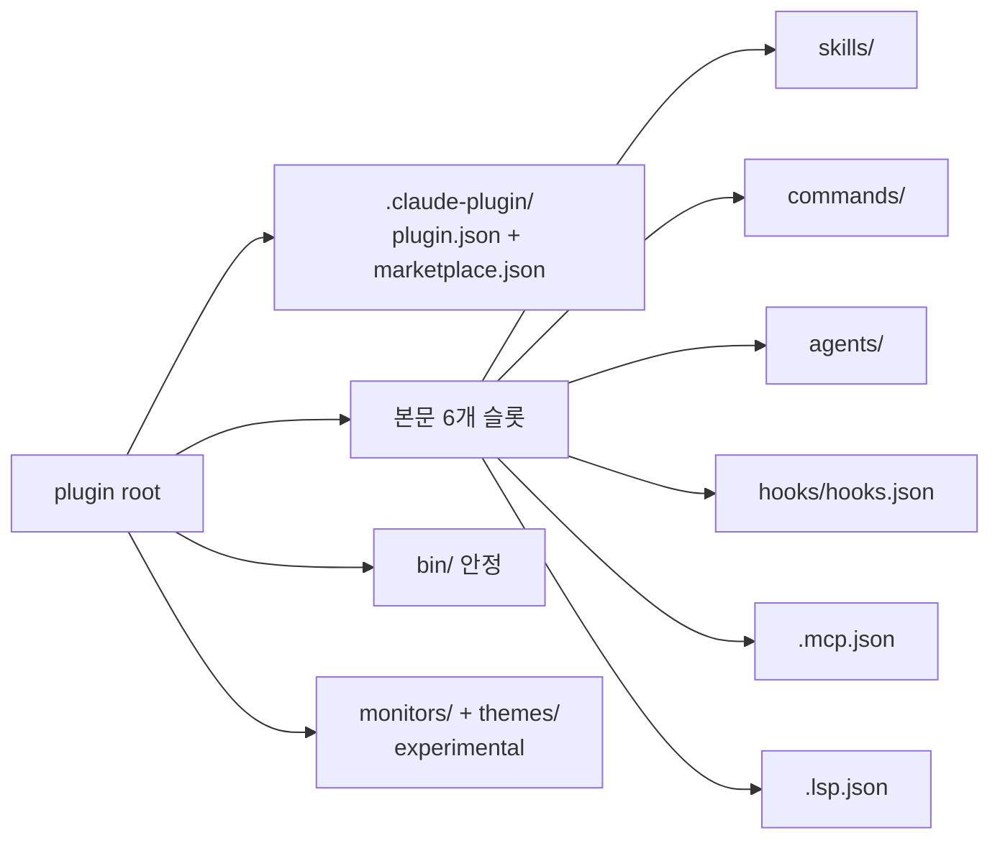
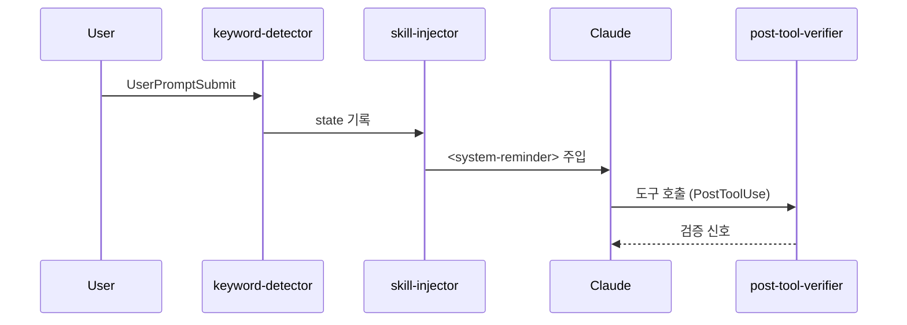
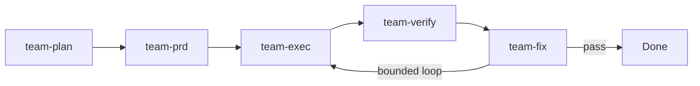

# 큰 Claude Code 플러그인은 어떻게 만들어지는가
## OMC 해부와 나만의 OMC 만들기

발표자: 김대현

차주에 Superpowers/SuperClaude 코드를 직접 읽기 전에, 큰 플러그인의 공통 구조를 한 번 정리하고 싶었습니다.

---

## 한 줄 요약 (TL;DR)

- 플러그인 본문 핵심은 6개 슬롯입니다: `skills/`, `commands/`, `agents/`, `hooks/hooks.json`, `.mcp.json`, `.lsp.json`
- OMC는 에이전트 레인을 1차 조립 단위로 두고, 그 위에 상태와 팀 인프라를 얹은 무거운 구조입니다
- Superpowers는 SKILL.md 한 장이 워크플로 전체를 짊어지는 가벼운 구조이고, `agents/`와 MCP가 아예 없습니다
- 이 둘을 가르는 한 축은 "오케스트레이션이 어디에 사는가"입니다 — 스킬 안이면 Superpowers, 스킬 밖이면 OMC
- 학습 로드맵 6단계: Stage 1 install ▶ Stage 2 훅 ▶ Stage 3 에이전트 ▶ Stage 4 MCP ▶ Stage 5 PRD ▶ Stage 6 team

<!-- 출처: REPORT.ko.md §0 -->

---

## Claude Code 플러그인 해부도



<!-- 렌더링 안 되면 ASCII 다이어그램으로 자동 fallback -->
<!-- 출처: REPORT.ko.md §1, plugin-frameworks-external.md §3 -->

---

## plugin.json / marketplace.json

```json
{
  "name": "my-plugin",
  "version": "0.1.0",
  "skills": "./skills/",
  "hooks": "./hooks/hooks.json",
  "mcpServers": "./.mcp.json"
}
```

- 필수 필드는 kebab-case `name` 하나뿐 — 나머지는 모두 선택
- 런타임에 `${CLAUDE_PLUGIN_ROOT}`가 설치된 플러그인 경로로 치환
- `marketplace.json`: `plugins[]`에 `source: "./"`, `category` 등록 — `/plugin marketplace add` 대상

<!-- 출처: plugin-frameworks-external.md §3, plugin-frameworks-internal-omc.md §1, REPORT.ko.md §1 -->

---

## OMC 깊이 보기 (1) 패키징 + Skills

```json
{ "name": "oh-my-claudecode", "version": "4.13.2",
  "skills": "./skills/", "mcpServers": "./.mcp.json" }
```

```
oh-my-claudecode/
├── .claude-plugin/{plugin.json, marketplace.json}
├── skills/        agents/        hooks/hooks.json
├── bridge/{mcp-server,team-mcp,cli}.cjs
├── .mcp.json      package.json
```

- `bin`에 `omc`, `omc-cli`, `oh-my-claudecode` → 모두 `bridge/cli.cjs`
- `files`: `dist, agents, bridge, commands, hooks, scripts, skills, templates, docs, .claude-plugin, .mcp.json, README.md, LICENSE`
- OMC 컨벤션 `level` 필드: ◆ 1=가벼운 도우미, ◆ 4=PRD 루프 같은 무거운 워크플로

<!-- 출처: .claude-plugin/plugin.json, package.json, skills/ralph/SKILL.md, REPORT.ko.md §2.1-2.2 -->

---

## OMC 깊이 보기 (2) Agents

```yaml
---
name: architect
model: opus
disallowedTools: Write, Edit
---
```


핵심: "도구 권한으로 역할을 강제" — `disallowedTools`로 실제로 막아 둠
레인: Build/Analysis · Review · Domain · Coordination(critic)

<!-- 출처: agents/architect.md, docs/ARCHITECTURE.md, REPORT.ko.md §2.3 -->

---

## OMC 깊이 보기 (3) Hooks



- 28종 라이프사이클 이벤트 — UserPromptSubmit, SessionStart, PreToolUse, PostToolUse, Stop, PreCompact 등
- 신호 패턴: `[MAGIC KEYWORD: autopilot]`, `The boulder never stops`, `<remember>`(7일 TTL)
- 킬 스위치: `DISABLE_OMC=1`, `OMC_SKIP_HOOKS=keyword-detector,skill-injector`

<!-- 출처: hooks/hooks.json, REPORT.ko.md §2.4 -->

---

## OMC 깊이 보기 (4) MCP + .omc/ + Team

```
.omc/state/sessions/{sessionId}/
├── autopilot-state.json    ralph-state.json
├── ultrawork-state.json    team-state.json
├── ralplan-state.json      skill-active-state.json
└── boulder-state.json      cancel-signal-state.json
```



- bridge: `mcp-server.cjs` 963KB · `team-mcp.cjs` 657KB · `cli.cjs` 3.14MB

<!-- 출처: bridge/*.cjs, .omc/ tree, REPORT.ko.md §2.5, §2.7 -->

---

## Superpowers — 가벼움이 곧 정체성

14 skills (agents/, commands/, MCP, src/ 모두 없음):

| | | |
| --- | --- | --- |
| brainstorming | subagent-driven-development | test-driven-development |
| writing-plans | writing-skills | dispatching-parallel-agents |
| executing-plans | finishing-a-development-branch | receiving-code-review |
| requesting-code-review | systematic-debugging | using-git-worktrees |
| using-superpowers | verification-before-completion | |

- `hooks/hooks.json`은 SessionStart 단일 — 28종 중 1종만
- "Skills as codified engineering culture" — behavioral eval 증거 없는 PR은 거부
- 멀티 하네스: Codex CLI / Codex App / Gemini CLI / OpenCode / Cursor / Copilot CLI

<!-- 출처: github.com/obra/superpowers, blog.fsck.com/2025/10/09/superpowers/, plugin-frameworks-external.md §1 -->

---

## 비교 한 장 — 4 프레임워크

```mermaid
quadrantChart
  title 오케스트레이션이 어디에 사는가
  x-axis 가벼움 --> 무거움
  y-axis 스킬 안 --> 스킬 밖
  quadrant-1 무거운 인프라 (스킬 밖)
  quadrant-2 가벼운 인프라
  quadrant-3 가벼운 콘텐츠
  quadrant-4 무거운 콘텐츠
  Superpowers: [0.2, 0.2]
  Official: [0.3, 0.5]
  SuperClaude: [0.7, 0.4]
  OMC: [0.85, 0.85]
```

| | OMC | Superpowers | SuperClaude | Official |
| --- | --- | --- | --- | --- |
| 조립 단위 | 에이전트 레인 | SKILL.md | 슬래시 + 페르소나 | 합성 프리미티브 |
| 상태 | `.omc/state/` | 무상태 | CLAUDE.md 주입 | 없음 |
| 멀티 에이전트 | team plan→fix loop | 스킬 *안* | 자동 페르소나 | worktree 격리 |

<!-- 출처: REPORT.ko.md §4, plugin-frameworks-external.md §4 -->

---

## 있는 것 vs 없는 것

<div style="display:flex;gap:2em;">
<div style="flex:1;">

▶ **OMC가 공짜로 주는 것**

- 키워드 라우팅 (UserPromptSubmit)
- 상태 보존 (state-sessions + PreCompact)
- 검증 게이트 (architect+security+code-review 합의)
- 팀 파이프라인 (plan→prd→exec→verify→fix)

</div>
<div style="flex:1;">

▶ **Superpowers가 더 잘하는 것**

- 다중 하네스 (Codex/Gemini/Cursor 등 6종)
- 가벼움 (학습 곡선 = SKILL.md 하나)
- 행동 평가 튜닝 (behavioral eval 게이트)

</div>
</div>

한 줄: **OMC는 인프라, Superpowers는 콘텐츠.**

<!-- 출처: REPORT.ko.md §5 -->

---

## 나만의 OMC 만들기 — 6단계 로드맵

```
Stage 1 ──▶ Stage 2 ──▶ Stage 3 ──▶ Stage 4 ──▶ Stage 5 ──▶ Stage 6
hello      keyword     첫 agent    자체 MCP    PRD 루프    mini-team
SKILL.md   훅          READ-ONLY   2 도구      mini-ralph   3 에이전트
```

| Stage | 산출물 | 다음 트리거 |
| --- | --- | --- |
| 1 | `plugin.json` + `skills/hello/SKILL.md` | "키워드만 쳐도 떴으면" |
| 2 | `hooks/hooks.json` + 매처 훅 | "역할별 일꾼 두고 싶다" |
| 3 | 첫 에이전트 + `disallowedTools` | "세션 메모 다시 읽고 싶다" |
| 4 | `.mcp.json` + state_read/write | "PRD 루프로 반복하고 싶다" |
| 5 | `mini-ralph` + `.omc/prd.json` | "단계별 분업 하고 싶다" |
| 6 | `mini-team` + planner/executor/verifier | (다중 하네스 모방) |

<!-- 출처: REPORT.ko.md §6 -->

---

## 다음 2주 학습 계획

**이번 주 (휴일, 1.5h) — 큰 그림만:**
- 화 30분: blog.fsck.com Superpowers 글 정독
- 목 30분: code.claude.com plugins-reference 매니페스트
- 토 30분: 본 보고서 §1, §4 다시 읽기

**다음 주 (코드 읽기, 9h):** 5개 plugin.json 비교 → Superpowers 핵심 SKILL.md → SuperClaude `src/` 100줄 요약 → §4 빈 표 손으로 채우기

**차차주 (훅 + Stage 1~2, 10h):** 게이트 = "Stage 2 hello가 키워드 트리거에 응답"

<!-- 출처: REPORT.ko.md §7 -->

---

## 흔한 실수 5개

- ● `name`이 kebab-case 아니면 설치 침묵 실패 → `/plugin list` 안 보이면 의심
- ● `/<plugin>:<skill>` namespacing 잊으면 표준 스킬과 충돌
- ● 디버깅 `console.log` → stdout 새면 MCP stdio 프레임 깨짐 (stderr/파일로)
- ● MCP 도구 `inputSchema` 누락 시 호출 측 검증 에러
- ● 세션 ID 전역 캐시 → 다중 세션에서 섞임. 인자 sessionId만 신뢰

★ 보너스: description에 워크플로 다 적으면 모델이 본문을 안 읽음 — "언제 쓰는가"만 한 줄로 (Superpowers `writing-skills/SKILL.md` 발견)

<!-- 출처: REPORT.ko.md §6 Stage 1/2/4, plugin-frameworks-external.md §1 -->

---

## 다음 액션

우리 팀이 다음에 시도해 볼 것:

1. **Stage 1 hello 플러그인 한 명씩 만들기** — 1시간이면 끝나고, namespacing 감각이 생깁니다
2. **OMC `scripts/keyword-detector.mjs` 같이 읽기** — UserPromptSubmit 훅의 살아 있는 표본
3. **차차주 마지막 날 또는 그 다음 주 월요일 Stage 2 데모** — 자기 키워드 라우팅 시연

레포: https://github.com/vimkim/omc-code-analysis
보고서: `REPORT.ko.md` (§6 Stage 1~6 그대로 따라가시면 됩니다)

<!-- 출처: REPORT.ko.md §6, §7 -->

---

## 예상 질문 백업

**Q1. 우리 회사 환경에서 OMC 그대로 깔아도 되나요?**
- npm 패키지 글로벌 설치 가능, 다만 28종 hook 중 일부는 환경 따라 침묵 실패 — `DISABLE_OMC=1`로 끄고 시작 권장

**Q2. Superpowers와 OMC 중 우리 팀에 뭐가 맞을까요?**
- 멀티 하네스(Codex/Gemini)도 쓴다 → Superpowers, 검증 게이트와 PRD 루프 → OMC. 둘 다 깔고 키워드만 분리해도 됩니다

**Q3. SuperClaude는 왜 비교에만 짧게 들어갔나요?**
- 4.3.0 README "30 commands / 20 agents / 7 modes / 8 MCP" 카운트만 인용. Python 인스톨러 + 페르소나 자동 활성이 결이 달라 차주 직접 읽기로 미뤘습니다

<!-- 출처: REPORT.ko.md §4, §7.1, plugin-frameworks-external.md §2 -->
